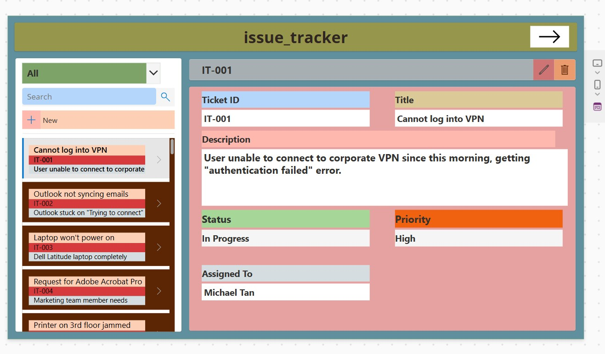
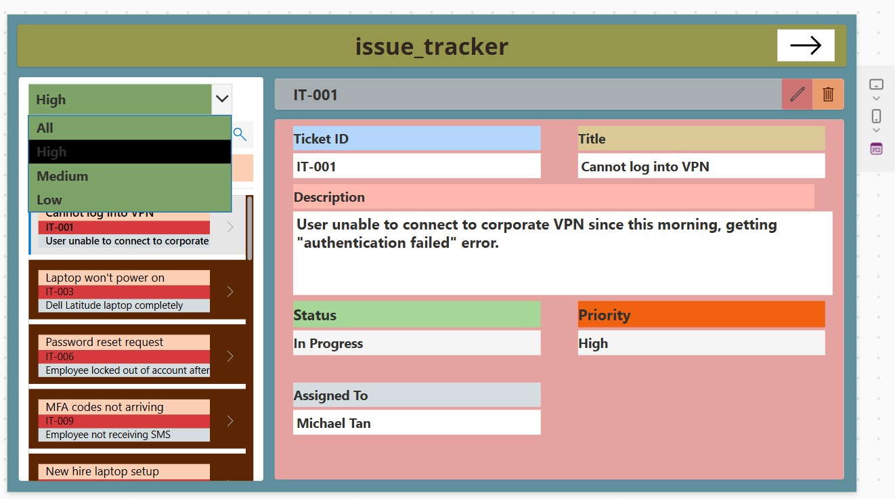
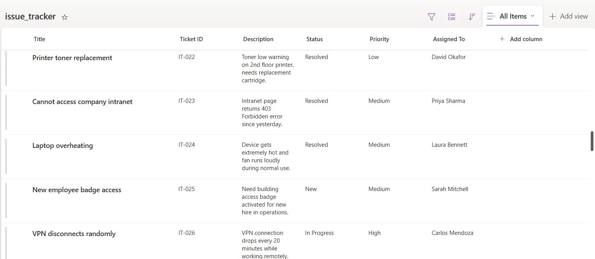

## Issue-Tracker-App

Issue Tracker app using Power Apps & SharePoint as a Backend.

The Issue Tracker is a Power Apps-based application designed to
streamline and manage IT support tickets efficiently within an
organization.

This application helps IT teams track, prioritize, and resolve
issues by providing a centralized platform with real-time status
updates and priority-based filtering.

## Features

- Raise and log new IT support tickets
- View all active tickets with status and priority
- Filter tickets by priority (All / High / Medium / Low)
- Search tickets by keyword
- View detailed ticket information (ID, Title, Description,
  Status, Priority, Assigned To)
- Dedicated Resolved Tickets screen for closed issues.

 ## Technologies Used

- Microsoft Power Apps (Canvas App)
- SharePoint (Data source)
- Gallery Control (ticket listing)
- Form Control (detail view)
- Power Apps Filter() & Search() functions

## Key Highlights

- Multi-screen navigation (Main Screen → Resolved Tickets Screen)
- Split-panel UI design (Gallery list + Detail view)
- Priority-based filtering (All / High / Medium / Low)
- Real-time SharePoint data — no hardcoding
- Form-gallery sync for seamless ticket detail viewing
- Scalable solution for IT helpdesk team.

 📸 Screenshots

### Main Screen - All Tickets

### Priority Filter - High / Medium / Low

### Resolved Tickets Screen

### SharePoint Backend - Data Source

